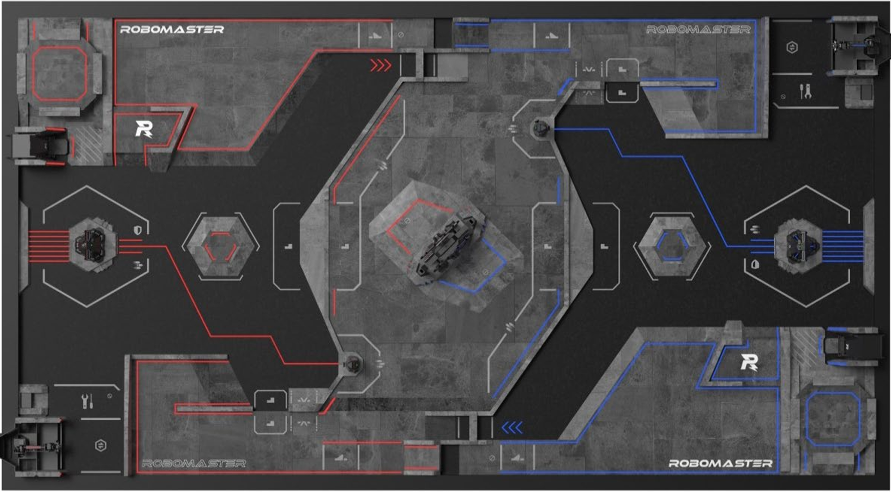

# RMUC 2026 哨兵模拟器（俯视图设施版）

本版本以场地俯视图为基础，完成了设施位置建模、地形判定、裁判系统消息输出与哨兵请求响应接口。

## 快速启动（Windows）

1. 创建虚拟环境（可选）

```powershell
py -3.14 -m venv .venv
```

2. 安装依赖

```powershell
.venv\Scripts\python.exe -m pip install -U pip
.venv\Scripts\python.exe -m pip install -r requirements.txt
```

3. 运行

```powershell
.venv\Scripts\python.exe rm26_sentry_simulator.py
.venv\Scripts\python.exe simulator.py
```

4. 如果提示 `禁止运行脚本`（Activate.ps1）

```powershell
Set-ExecutionPolicy -Scope Process -ExecutionPolicy Bypass
```

说明：你也可以完全不执行 Activate，直接使用 `.venv\\Scripts\\python.exe` 启动。

## 1. 地图与场地基准

- 地图源：场地-俯视图.png
- 标定尺寸：1576 × 873（像素坐标）
- 当前坐标约定：世界坐标与地图像素一一对应

场地图：



## 2. 已确认设施类型与区域

以下设施已写入配置 map.facilities，同时在 MapManager 中可查询。

| 设施类型 | 区域ID示例 | 说明 |
|---|---|---|
| 基地 | red_base, blue_base | 左右主基地 |
| 前哨站 | red_outpost, blue_outpost | 左右前哨站 |
| 能量机关 | energy_mechanism_center | 中央能量机关区域 |
| 飞坡 | fly_slope_top, fly_slope_bottom | 上下飞坡走廊 |
| 起伏路段 | undulating_road_left, undulating_road_right | 左右主干道起伏区 |
| 一级台阶 | first_step_top, first_step_bottom | 上下一级台阶 |
| 狗洞 | dog_hole_mid_top, dog_hole_mid_bottom | 中路上下狗洞通道 |
| 二级台阶 | second_step_top, second_step_bottom | 上下二级台阶 |

补充：外边界采用 boundary_outer 带厚度判定，默认不可通行。

## 3. 地形识别与碰撞约束

MapManager.get_terrain_type 已支持下列输出：

- 基地
- 前哨站
- 能量机关
- 飞坡
- 起伏路段
- 一级台阶
- 狗洞
- 二级台阶
- 边界
- 平地

PhysicsEngine 通过 is_position_valid 对不可通行区域生效：

- 墙
- 边界
- 狗洞

## 4. 裁判系统消息（已接入）

GameEngine.get_game_state 现包含 referee.red 与 referee.blue，两侧都可直接给 AI Agent 使用。

消息字段：

- game_status：阶段、剩余时间、总时长
- robot_status：哨兵血量、热量、弹量、金币、姿态、姿态冷却、高度
- power_heat_data：姿态乘算（功率/冷却/受伤）
- event_data：基地血量、前哨站血量、占领增益、设施摘要、雷达标记目标
- radar_data：最大标记进度P、易伤倍率
- team_info：本方所有实体状态

## 5. 裁判请求响应功能（已提供接口）

RulesEngine 已增加以下可调用接口：

- request_posture_change：姿态切换请求（含冷却）
- request_exchange：兑换请求（弹量、血量、远程兑换、立即复活）
- confirm_respawn：确认复活

支持返回结构化结果：ok、code、附加数据（例如消耗金币、剩余金币等）。

## 6. 哨兵相关规则更新

- 哨兵基础血量：400
- 哨兵初始弹量：300
- 哨兵热量上限：300
- 姿态：mobile、attack、defense
- 姿态冷却：5秒
- 金币：每队每秒10，自动累计并同步到哨兵
- 雷达标记：基于距离累计 P 进度，满进度触发易伤倍率

## 7. 可视化校验

Renderer 已叠加设施区域线框和标签，可直接在运行窗口核对：

- 基地
- 前哨站
- 能量机关
- 飞坡
- 起伏路段
- 一级台阶
- 狗洞
- 二级台阶

## 8. 配置维护建议

你可以只改 config.json 里的 map.facilities 来继续微调点位，无需改代码。

也可以直接使用主窗口工具栏完成编辑：

1. 启动 simulator.py
2. 主窗口顶部工具栏可直接执行：
	- 开始/重开
	- 结束对局
	- 保存存档 / 载入存档
	- 保存设置
	- 浏览 / 设施编辑 / 站位编辑 / 规则编辑
3. 设施编辑：鼠标左键拖拽框选区域，Q/E 切换设施类型，右键删除当前设施
4. 站位编辑：鼠标左键放置实体，Q/E 切换实体，R 旋转朝向
5. 规则编辑：在右侧面板中直接调整对局时长、金币速率、血量、弹量、热量、雷达与兑换等数值
6. 点击“保存设置”或 Ctrl+S 后，设施、初始站位和规则会保存到 settings.json；下次启动会自动按该文件覆盖基础 config.json
7. F5 保存当前对局，F9 载入对局，P 暂停/继续

建议流程：

1. 启动模拟器
2. 对照俯视图观察设施框偏差
3. 修改对应区域坐标
4. 重启验证

## 9. 规则图与参考


